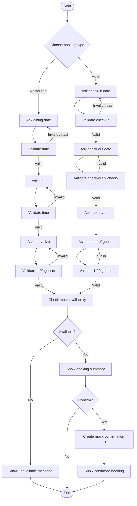

# Flow Diagram

## Conversation Summary

### Restaurant
1. Select Restaurant.
2. Enter date.
3. Enter time.
4. Enter party size.
5. Validate inputs.
6. Check mock availability.
7. Show booking summary.
8. Confirm or cancel.

### Hotel
1. Select Hotel.
2. Enter check-in date.
3. Enter check-out date.
4. Select room type.
5. Enter number of guests.
6. Validate inputs.
7. Check mock availability.
8. Show booking summary.
9. Confirm or cancel.
